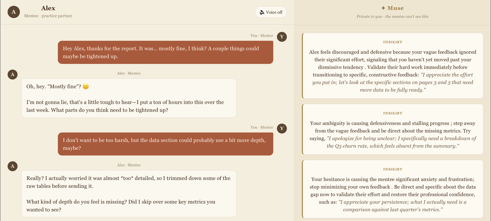
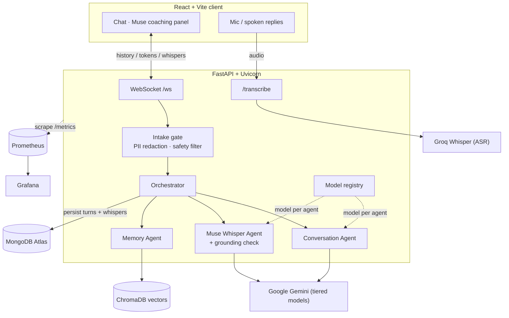

<div align="center">

# Muse-lite

**A real-time communication practice partner with private, AI-driven coaching.**

Role-play a difficult conversation while an AI plays the other person — and a separate "Muse" agent privately coaches you on tone, subtext, and patterns as you go.

[](https://github.com/SwastikChowdhury/muse-ai-lite/actions/workflows/ci.yml)


</div>

---

## Overview

Muse-lite is a multi-agent conversational system built around a split-screen experience: the practice conversation on the left, and a private coaching channel ("Muse") on the right. You play a **mentor** giving feedback; the AI plays **Alex**, a realistic **mentee**; and the Muse agent reads the exchange in real time, surfacing one labeled coaching note per turn — on tone, pacing, subtext, or recurring patterns it remembers from past sessions.

The system streams token-by-token over WebSockets, remembers your communication habits across sessions via vector retrieval, and is fully instrumented for cost, latency, and safety.

> 

## Features

- **Real-time streaming chat** — token-by-token replies over a WebSocket, with live client-side state.
- **Multi-agent orchestration** — an orchestrator coordinates a Conversation Agent (the mentee), a Muse Whisper Agent (private coaching), and a Memory Agent — each independently swappable.
- **Long-term memory (RAG)** — communication patterns are embedded in ChromaDB and retrieved with recency-aware reranking; coaching notes that cite past patterns are verified for grounding to mitigate hallucination.
- **Self-classifying coaching** — the Muse agent tags each note (Tone, Pattern, Subtext, Opening, Suggestion, Pacing, Clarity, Empathy, Boundary).
- **Voice in and out** — speech-to-text via Groq Whisper, replies read aloud via the browser Speech Synthesis API.
- **Model registry + live rollback** — a single source of truth for each agent's model, with tiered model selection and a runtime rollback endpoint.
- **Safety & privacy** — a crisis-escalation filter that bypasses the model entirely, plus PII redaction applied at intake (before the LLM, the database, or the vector store).
- **Evaluation harness** — offline test cases (safety, privacy, grounding) in CI, plus a live eval runner that scores empathy and recall through the real pipeline.
- **Full observability** — Prometheus + Grafana dashboards tracking tokens, estimated cost, per-agent latency, quota pressure, grounding, and safety escalations.
- **Containerized & CI-tested** — one Docker image serves the whole app; GitHub Actions lints, tests, smoke-tests the container, and publishes to GHCR.

## Architecture



### Request lifecycle (one turn)

1. **Intake gate** — the message is PII-redacted and run through the safety filter. A crisis message returns an escalation response immediately and never reaches a model.
2. **Memory retrieve** — the Memory Agent pulls the mentor's relevant past patterns from ChromaDB (similarity × recency).
3. **Conversation Agent** — Gemini replies in character as the mentee, streamed token-by-token to the chat panel.
4. **Muse Whisper Agent** — a second model call produces one labeled coaching note; any citation of a past pattern is verified against what was actually retrieved.
5. **Persist & remember** — the turn and the whisper are written to MongoDB (separate collections), and the mentor's message is added to vector memory.

Conversation turns and coaching notes are stored in **separate MongoDB collections** so private coaching can never leak back into the model's conversation context.

## Tech stack

| Layer | Technology |
| --- | --- |
| Frontend | React + Vite (built and served by FastAPI in production) |
| Backend | FastAPI + Uvicorn, async WebSockets |
| LLM | Google Gemini, tiered per agent (registry-driven) |
| Persistence | MongoDB Atlas (Motor async driver) |
| Vector memory | ChromaDB (local, persistent) |
| Voice | Groq Whisper (ASR) · browser SpeechSynthesis (TTS) |
| Observability | Prometheus + Grafana |
| Packaging / CI | Docker · GitHub Actions · GHCR |

## Getting started

### Prerequisites

- Docker & Docker Compose (for the full stack), or Python 3.10 + Node 20 for local dev
- A MongoDB Atlas connection string, a Google Gemini API key, and a Groq API key

### Configuration

Create `backend/.env` (values **unquoted**):

| Variable | Description |
| --- | --- |
| `GEMINI_API_KEY` | Google Gemini API key (billing-enabled recommended) |
| `MONGODB_URI` | MongoDB Atlas connection string |
| `GROQ_API_KEY` | Groq API key (Whisper speech-to-text) |

### Run the full stack (recommended)

Brings up the app, Prometheus, and Grafana together:

```bash
docker compose up --build
# app        -> http://localhost:8000
# Prometheus -> http://localhost:9090
# Grafana    -> http://localhost:3000   (anonymous access; Muse dashboard provisioned)
```

### Run for local development

Backend (from `backend/`):

```bash
python -m venv .venv && source .venv/bin/activate
pip install -r requirements.txt
uvicorn main:app --reload --port 8000
```

Frontend (from `frontend/`):

```bash
npm install
npm run dev        # Vite dev server on :5173
```

## Project structure

```
muse-ai-lite/
├── backend/
│   ├── agents.py             # conversation + whisper agents, prompts, label parsing
│   ├── orchestrator.py       # per-turn agent coordination + grounding verification
│   ├── main.py               # FastAPI app: WebSocket, transcribe, admin endpoints
│   ├── memory.py             # ChromaDB vector memory (rerank, clear)
│   ├── model_registry.py     # model-per-agent registry + rollback
│   ├── safety.py             # crisis-escalation filter
│   ├── privacy.py            # PII redaction
│   ├── metrics.py            # Prometheus counters / gauges / histograms
│   ├── llm_metrics.py        # token + estimated-cost accounting
│   ├── db.py                 # Motor (async MongoDB) persistence
│   ├── models.py             # Pydantic models
│   ├── conftest.py           # pytest path / env setup
│   ├── requirements.txt
│   ├── tests/                # pytest suite (runs in CI)
│   └── evals/                # live evaluation harness
├── frontend/                 # React + Vite client
├── monitoring/
│   ├── prometheus.yml
│   └── grafana/provisioning/
│       ├── dashboards/       # dashboard.yml + muse-dashboard.json
│       └── datasources/      # datasource.yml
├── .github/workflows/ci.yml  # lint · test · build · smoke-test · publish
├── Dockerfile                # multi-stage: build frontend, serve from FastAPI
├── docker-compose.yml        # app + Prometheus + Grafana
├── .dockerignore
├── LICENSE
└── README.md
```

## API reference

| Method | Path | Description |
| --- | --- | --- |
| `GET` | `/health` | Liveness check |
| `GET` | `/metrics` | Prometheus metrics |
| `WS` | `/ws` | Streaming chat (history / token / done / whisper) |
| `POST` | `/transcribe` | Audio → text via Groq Whisper |
| `GET` | `/admin/models` | Current model registry |
| `POST` | `/admin/rollback/{agent}` | Roll an agent back to its previous model |
| `DELETE` | `/admin/clear-data` | Wipe the user's conversation, whispers, and memories |

## Testing

The suite runs without external services (LLM, DB, and ASR calls are mocked) and executes in CI on every push:

```bash
cd backend
pytest tests -q
```

It covers the data models and Mongo serialization, the HTTP and WebSocket endpoints, the orchestrator's resilience paths (quota fallback, whisper failure), grounding verification, and the safety/PII filters. A separate live harness exercises the real agents:

```bash
python -m evals.run_eval     # makes real Gemini calls
```

## Observability

The backend exposes Prometheus metrics at `/metrics`, including app-specific series:

- `muse_llm_tokens_total{agent, kind}` and `muse_llm_cost_usd_total{agent}` — token usage and estimated spend per agent
- `muse_agent_latency_seconds{agent}` — per-agent latency (motivates model tiering)
- `muse_gemini_calls_total{agent, outcome}` — throughput and quota/error pressure
- `muse_whisper_grounding_total{status}` — grounded vs ungrounded coaching notes
- `muse_safety_escalations_total` — messages caught by the safety filter

Grafana ships with a provisioned dashboard (spend, tokens, latency, calls, grounding, safety), brought up automatically by `docker compose`.

## CI/CD

GitHub Actions runs on every push and PR to `main`: **ruff** lint → **pytest** → Docker **build** → container **smoke test** (`/health`) → **publish** a `latest` and commit-`SHA`-tagged image to the GitHub Container Registry.

**Continuous deployment (planned):** Google **Cloud Run** is the target — it runs the container and natively supports the persistent WebSocket that function-based serverless platforms cannot. Images push to **Artifact Registry**, deploys authenticate via **Workload Identity Federation**, and ship on a green CI run. SHA-tagged images make rollbacks traceable.

## Roadmap / how this scales

- **Privacy** — move generation to **Vertex AI** (no training on inputs) behind the same interface.
- **Orchestration** — adopt **Google ADK** or **LangGraph** for typed state, retries, and tracing.
- **Vector store** — graduate from ChromaDB to a managed store (**FAISS/Milvus**, or **MongoDB Atlas Vector Search** to unify the stack).
- **Context cache** — **Redis / Memorystore** for hot conversation context.
- **Multi-user** — real auth and per-user sessions backed by **Cloud SQL (Postgres)**.
- **Evaluation** — replace keyword scoring with **LLM-as-judge** rubrics and online A/B testing.
- **Deployment** — activate the Cloud Run CD pipeline for a live URL on every merge.

## License

Released under the [MIT License](LICENSE).