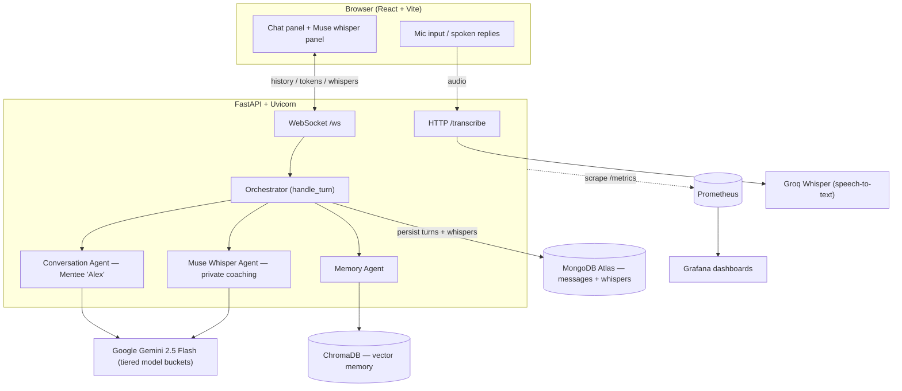

# Muse-lite

A real-time **communication practice partner**. You role-play a difficult conversation — here, a mentor giving feedback — while an AI plays the other person and a separate "Muse" agent privately coaches you on the side, reading the subtext and suggesting how to respond. The conversation streams live, and Muse's coaching, plus your communication patterns, persist across sessions.

The app is containerized, tested in CI, and instrumented for observability — runnable as a single Docker image or as a full local stack with metrics dashboards.

## Architecture

A single FastAPI service serves the React app, a streaming WebSocket, and an audio-transcription endpoint. Every turn is coordinated by an **orchestrator** that routes through three specialized agents, and the service exports Prometheus metrics for observability.



**What happens on each turn** (`orchestrator.handle_turn`):

1. **Memory Agent (retrieve)** — query ChromaDB for the user's relevant patterns from past sessions.
2. **Conversation Agent** — Gemini plays the mentee in character; its reply streams token-by-token to the chat panel.
3. **Muse Whisper Agent** — a second model call analyzes the exchange and returns one private coaching note. It runs on a separate model bucket from the conversation agent (cost/latency/quota isolation) and fails soft: a transient error degrades to a "momentarily busy" notice instead of breaking the turn.
4. **Memory Agent (write)** — store the mentor's message so future sessions can recognize recurring habits.

Conversation turns and whispers are saved to **separate MongoDB collections** (`messages` and `whispers`) — deliberately, so private coaching can never leak back into the agent's conversation context.

**WebSocket protocol** — server → client: `history` (on connect), `token` (streamed reply), `done`, `whisper`. Client → server: raw user text, whether typed or transcribed from voice.

## Tech stack

- **Frontend:** React + Vite (built to static files and served by FastAPI in the container)
- **Backend:** FastAPI + Uvicorn, async WebSocket streaming
- **LLM:** Google Gemini 2.5 Flash, tiered across model buckets per agent
- **Persistence:** MongoDB Atlas (Motor async driver)
- **Vector memory:** ChromaDB (local, persistent), embedding locally — no LLM call
- **Voice:** Groq Whisper (speech-to-text) · browser `SpeechSynthesis` (text-to-speech)
- **Observability:** Prometheus + Grafana, via a `/metrics` endpoint
- **Packaging & CI:** Docker (single image) · GitHub Actions (lint, test, build, publish)
- **Deployment (planned):** Google Cloud Run + Artifact Registry

## Running locally

Set `GEMINI_API_KEY`, `MONGODB_URI`, and `GROQ_API_KEY` in `backend/.env` first.

**Dev mode** (hot reload) — backend from `backend/`:

```bash
python -m venv .venv && source .venv/bin/activate
pip install -r requirements.txt
uvicorn main:app --reload --port 8000
```

Frontend from `frontend/`:

```bash
npm install
npm run dev   # Vite dev server on :5173
```

**Single container** — the whole app (frontend served by FastAPI) on one port:

```bash
docker build -t muse .
docker run --rm --env-file backend/.env -p 8000:8000 muse   # http://localhost:8000
```

**Full stack with observability** — app + Prometheus + Grafana:

```bash
docker compose up --build
# app        -> http://localhost:8000
# Prometheus -> http://localhost:9090   (Targets tab shows the app UP)
# Grafana    -> http://localhost:3000   (anonymous admin; Muse dashboard provisioned)
```

## Testing

A `pytest` suite (run `pytest backend/tests`) covers the application logic without hitting external services:

- **Models** — field validation and Mongo serialization.
- **Endpoints** — `/health`, `/metrics`, and `/transcribe` (Groq mocked).
- **Orchestrator** — the agent-coordination happy path plus both resilience paths: quota-exhaustion fallback and whisper-failure (verifying no junk note is persisted).
- **WebSocket** — the full `history -> token -> done -> whisper` protocol end to end.

Linting is via `ruff`.

## CI/CD

GitHub Actions runs on every push and pull request to `main` (`.github/workflows/ci.yml`):

1. **Lint** with ruff and **test** with pytest.
2. **Build** the Docker image.
3. **Smoke-test** the running container (boots it, asserts `/health`).
4. On merges to `main`, **publish** a `latest` and commit-`SHA`-tagged image.

### Continuous deployment (planned — Google Cloud Run)

The target is **Google Cloud Run**: it runs the container directly and natively supports the app's persistent WebSocket. Images are pushed to **Artifact Registry**, and deploys are gated on a green CI run via **Workload Identity Federation** (keyless GitHub → GCP auth). In production the model layer would move to **Vertex AI** (no training on inputs), keeping the whole stack on Google.

The deploy workflow lives at `.github/workflows/deploy.yml`:

```yaml
name: Deploy to Cloud Run

on:
  workflow_run:
    workflows: ["CI"]
    types: [completed]
    branches: [main]

permissions:
  contents: read
  id-token: write          # required for Workload Identity Federation

env:
  PROJECT_ID: your-gcp-project
  REGION: us-central1
  SERVICE: muse-ai-lite
  REPO: muse               # Artifact Registry repository name

jobs:
  deploy:
    if: ${{ github.event.workflow_run.conclusion == 'success' }}
    runs-on: ubuntu-latest
    steps:
      - uses: actions/checkout@v4

      - id: auth
        uses: google-github-actions/auth@v2
        with:
          workload_identity_provider: ${{ secrets.GCP_WIF_PROVIDER }}
          service_account: ${{ secrets.GCP_SERVICE_ACCOUNT }}

      - uses: google-github-actions/setup-gcloud@v2

      - name: Configure Docker for Artifact Registry
        run: gcloud auth configure-docker ${{ env.REGION }}-docker.pkg.dev --quiet

      - name: Build and push image
        run: |
          IMAGE="${REGION}-docker.pkg.dev/${PROJECT_ID}/${REPO}/${SERVICE}:${{ github.sha }}"
          docker build -t "$IMAGE" .
          docker push "$IMAGE"
          echo "IMAGE=$IMAGE" >> "$GITHUB_ENV"

      - name: Deploy to Cloud Run
        run: |
          gcloud run deploy "$SERVICE" \
            --image "$IMAGE" \
            --region "$REGION" \
            --platform managed \
            --allow-unauthenticated \
            --port 8000 \
            --timeout 3600 \
            --set-env-vars "GEMINI_API_KEY=${{ secrets.GEMINI_API_KEY }},GROQ_API_KEY=${{ secrets.GROQ_API_KEY }},MONGODB_URI=${{ secrets.MONGODB_URI }}"
```

Notes:
- **`--timeout 3600`** keeps long-lived WebSocket connections from being cut at the default request timeout.
- App secrets are passed as GitHub Actions secrets here for simplicity; in production they would come from **Google Secret Manager**.
- The container must listen on the port Cloud Run expects — honor `$PORT` in the Dockerfile (`--port ${PORT:-8000}`) or keep `--port 8000` consistent on both sides.

## Observability

The FastAPI service exposes Prometheus metrics at `/metrics` — default HTTP metrics plus app-specific ones. Prometheus scrapes the app and a provisioned Grafana dashboard visualizes four project-relevant views:

1. **Active conversations** — live WebSocket connections (`muse_active_websocket_connections`).
2. **Agent response latency (p95)** — conversation vs whisper, which justifies the lighter whisper model bucket.
3. **Conversation agent calls by outcome** — `ok` / `quota` (429) / `error`, surfacing rate-limit pressure on the main reply path.
4. **Whisper agent calls by outcome** — the fail-soft coaching path, showing when graceful degradation kicks in.

Everything comes up together with `docker compose`.

## How I'd scale this

The container, CI pipeline (test + publish), and observability stack above are built. The remaining steps for production:

- **Data privacy.** Free-tier Gemini may train on inputs — unacceptable for sensitive interpersonal data. Move to **Vertex AI**, which doesn't train on your data, behind the same model interface.
- **Orchestration.** Replace the hand-rolled orchestrator with **Google ADK** or **LangGraph** for typed state, structured retries, and built-in tracing — without changing the agent boundaries.
- **Vector store.** ChromaDB-on-disk is ephemeral on serverless hosts; move to a managed store (**FAISS/Milvus**, or **MongoDB Atlas Vector Search** to unify on one datastore). Retrieval is abstracted behind the Memory Agent, so the swap is localized.
- **Short-term context.** A **Redis** (Memorystore) cache for hot conversation context instead of re-reading Mongo each turn.
- **Multi-user state.** Replace the fixed demo user/conversation IDs with real auth and per-user sessions, with **Cloud SQL (Postgres)** for relational and account data.
- **Continuous deployment.** Activate the `deploy.yml` above so each green CI run ships to Cloud Run, giving a live URL on every merge.