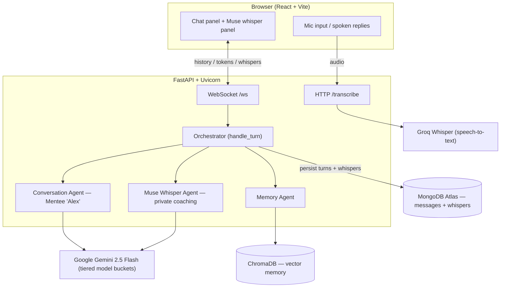

# Muse-lite

A real-time **communication practice partner**. You role-play a difficult conversation — here, a mentor giving feedback — while an AI plays the other person and a separate "Muse" agent privately coaches you on the side, reading the subtext and suggesting how to respond. The conversation streams live, and Muse's coaching, plus your communication patterns, persist across sessions.

The interface is split: the practice conversation on the left, Muse's private whispers on the right.

## Architecture

A single FastAPI service serves the React app, a streaming WebSocket, and an audio-transcription endpoint. Every turn is coordinated by an **orchestrator** that routes through three specialized agents.



**What happens on each turn** (`orchestrator.handle_turn`):

1. **Memory Agent (retrieve)** — query ChromaDB for the user's relevant patterns from past sessions.
2. **Conversation Agent** — Gemini plays the mentee in character; its reply streams token-by-token to the chat panel.
3. **Muse Whisper Agent** — a second model call analyzes the exchange and returns one private coaching note, sent to the Muse panel. It runs on a separate model bucket from the conversation agent (cost/latency/quota isolation) and fails soft: a transient error degrades to a "momentarily busy" notice instead of breaking the turn.
4. **Memory Agent (write)** — store the mentor's message so future sessions can recognize recurring habits.

Conversation turns and whispers are saved to **separate MongoDB collections** (`messages` and `whispers`) — deliberately, so private coaching can never leak back into the agent's conversation context.

**WebSocket protocol** — server → client: `history` (on connect), `token` (streamed reply), `done`, `whisper`. Client → server: raw user text, whether typed or transcribed from voice.

## Tech stack

- **Frontend:** React + Vite (built to static files and served by FastAPI in production)
- **Backend:** FastAPI + Uvicorn, async WebSocket streaming
- **LLM:** Google Gemini 2.5 Flash, tiered across model buckets per agent
- **Persistence:** MongoDB Atlas (Motor async driver)
- **Vector memory:** ChromaDB (local, persistent), embedding locally — no LLM call
- **Voice:** Groq Whisper (speech-to-text) · browser `SpeechSynthesis` (text-to-speech)

## Running locally

Backend (from `backend/`):

```bash
python -m venv .venv && source .venv/bin/activate
pip install -r requirements.txt
# create backend/.env with: GEMINI_API_KEY, MONGODB_URI, GROQ_API_KEY
uvicorn main:app --reload --port 8000
```

Frontend (from `frontend/`):

```bash
npm install
npm run dev   # Vite dev server on :5173
```

Open the Vite URL, type or speak as the mentor, and watch Alex reply while Muse coaches you on the right.

## How I'd scale this

The prototype is built on free tiers; here's where each piece would change for production.

- **Data privacy.** Free-tier Gemini may train on inputs — unacceptable for sensitive interpersonal data. Production would move to **Vertex AI**, which doesn't train on your data, with the same model interface.
- **Orchestration.** The hand-rolled orchestrator would move to **Google ADK** or **LangGraph** for typed state, structured retries, and built-in tracing — without changing the agent boundaries.
- **Vector store.** ChromaDB-on-disk is ephemeral on free hosts. At scale, a managed store (**FAISS/Milvus**, or **MongoDB Atlas Vector Search** to unify on one datastore). Retrieval is abstracted behind the Memory Agent, so the swap is localized.
- **Short-term context.** A **Redis** cache for hot conversation context instead of re-reading Mongo each turn.
- **Observability.** **OpenTelemetry** traces with a **Grafana** dashboard, tracking per-agent latency, cost, and error rates.
- **Cost & quota.** Model tiering across agents (already demonstrated), plus batching, rate-limit handling, and graceful fallback — so a provider hiccup can't take down a session.
- **Multi-user state.** Replace the fixed demo user/conversation IDs with real auth and per-user sessions, with **Postgres** for relational and account data.
- **Packaging & deploy.** One container (FastAPI serving the built frontend) to an autoscaling host (e.g. Cloud Run), behind CI that lints and tests on every push.